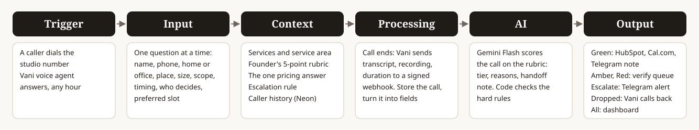

# Aangan Studio phone agent

An AI phone agent and dashboard for Aangan Studio, a Pune interior design studio. It answers every incoming enquiry call within seconds, at any hour, asks the founder's five questions one at a time, scores the call against his rubric, and hands good leads to a designer with everything already asked.



## What it does

1. A caller dials the studio number. A **Vani** voice agent answers (English and Hindi), introduces itself as Aangan Studio's assistant, and captures: name, phone, residential or commercial, location, carpet area, scope, timeline, who decides, and a preferred consultation slot. It never asks about budget and never quotes a price.
2. When the call ends, Vani posts the transcript, recording link and duration to `/api/vani/webhook`. The call is stored, then **Gemini Flash** turns the transcript into structured fields and a tier, and code checks the tier against the hard rules.
3. Output depends on the tier:

| Tier | Meaning | What happens |
|---|---|---|
| **Green** | Passes criteria 1 to 3; 4 and 5 met or unclear | HubSpot contact and deal, Cal.com consultation booking, Telegram handoff note (uncertainties listed) |
| **Amber** | 1, 2 or 3 unclear, or timeline fails but a later start works | Designer verify queue and a Telegram note marked "needs review" |
| **Red** | Clearly fails 1, 2 or 3, fails two or more, or a volunteered budget is clearly too low | Caller was closed politely on the call; logged in the verify queue for a designer to check. Nothing goes to HubSpot |
| **Escalate** | Existing client complaint | Skips scoring. Urgent Telegram alert for a senior callback within 15 minutes |
| **Dropped** | Very short call, no details | Logged, Telegram alert with the number so someone calls back |

4. **Dashboard** (no login): a designer view (call list, transcript, extracted fields, tier, status, verify queue with Approve and Drop) and a pipeline view for the founder (calls received, share answered within 5 minutes, calls outside 10am to 7pm, counts by tier, consultations booked, run cost in rupees per call and per month).

## Architecture

| Stage | What | Where |
|---|---|---|
| Trigger | Caller dials in; Vani answers. Web (WebRTC) calls are used for testing | Vani |
| Input | The agent asks one question at a time and captures the fields | `src/lib/vani-prompt.ts` |
| Context | Prompt holds services, area, rubric, the one allowed pricing answer and the escalation rule; Postgres holds caller history for repeat-caller detection | `src/lib/rules.ts`, Neon |
| Processing | Signed webhook, store the call, respond, then process after the response | `src/app/api/vani/webhook/route.ts`, `src/lib/pipeline.ts` |
| AI | One Gemini Flash call with a strict JSON schema, then deterministic tier rules | `src/lib/scoring/` |
| Output | HubSpot, Telegram, Cal.com, dashboard | `src/lib/integrations/`, `src/app/` |

Stack: Next.js 16 (App Router, TypeScript) on Vercel, Neon Postgres, Gemini `gemini-3.1-flash-lite`, Vani, HubSpot, Telegram, Cal.com.

## Rules live in one file

`src/lib/rules.ts` holds every constant: lead times, commercial size limits, the service-area list, excluded business types, the budget floor, dropped-call thresholds, the voice rate, the model and its prices, and the exact pricing answer. Change one value and the agent prompt, scoring prompt and tier logic all follow. See [DECISIONS.md](DECISIONS.md) for the judgement calls.

**Pricing is a hard rule.** The agent never says a number, range or rate. `tests/rules.test.ts` fails if the Vani prompt, the greeting, or any agent reply in the test fixtures contains a rupee amount.

## Run it

```bash
npm install
cp .env.example .env          # fill in the keys (see below)
npm run migrate               # creates the schema in Neon
npm test                      # unit tests, no network
npm run eval                  # runs T01-T20 through the real pipeline, stores them as test data
npm run dev                   # http://localhost:3000
```

`npm run eval` calls Gemini (about 2 rupees for all 21 cases) and writes `source='test'` rows, so the results appear on the dashboard. Test rows never reach HubSpot, Telegram or Cal.com; the call page shows what would have been sent.

## Integrations

| Service | Used for | Env |
|---|---|---|
| Vani | Voice agent, transcripts, recordings, webhook | `VANI_API_KEY`, `VANI_AGENT_ID`, `VANI_WEBHOOK_SECRET` |
| Gemini | Structured extraction and rubric scoring | `GEMINI_API_KEY` |
| Neon | Postgres: calls, AI runs, integration actions | `DATABASE_URL` |
| HubSpot | Contact and deal for green leads | `HUBSPOT_TOKEN` |
| Telegram | Handoff notes, review requests, urgent alerts, callbacks | `TELEGRAM_BOT_TOKEN`, `TELEGRAM_CHAT_ID` |
| Cal.com | Consultation booking from the caller's preferred time | `CALCOM_API_KEY`, `CALCOM_EVENT_TYPE_ID` |

Only real phone calls are ever sent to HubSpot, Telegram or Cal.com. `LIVE_INTEGRATIONS=true` switches them on; Vani web test calls stay test data unless `TREAT_WEB_CALLS_AS_LIVE=true`.

## Vani setup

`npm run setup:vani` creates (or updates) the agent through Vani's API: prompt from `src/lib/vani-prompt.ts`, greeting, English with Hindi auto-detect, and a 6-minute call cap. It writes `VANI_AGENT_ID` to `.env`. The webhook is registered in the Vani dashboard (Developers, Webhooks): URL `/api/vani/webhook` on the deployed app, event `call_postprocessing`, the shared signing secret. The public API does not cover webhook registration.

## Testing with a Vani web call

Open the agent in the Vani dashboard and press Start Test. A web call is stored as `source='test'`: it is scored and shows on the dashboard, but HubSpot, Telegram and Cal.com receive nothing, and the call page shows what would have been sent. Vani's Chat mode is cheaper (about 1.30 rupees for 1 minute 43 seconds) but does not fire the webhook and keeps no transcript, so only the Audio mode exercises the full path. To see the integrations fire end to end, set `TREAT_WEB_CALLS_AS_LIVE=true` in Vercel, redeploy, make one call, and set it back.

## Test results

All 20 phone cases plus one extra dropped-call case pass; see `fixtures/cases.ts` for the expectations (T01 to T20 are short paraphrases written for this repo, not the original transcripts).

## Cost

Voice is billed at `VOICE_RATE_INR_PER_MIN` (default 5.6) on the real call duration. Scoring is one Gemini call of roughly 1,300 input and 550 output tokens, about 10 paise. Both appear per call and per month on the pipeline view.

## Extending to WhatsApp and the web form

Both channels can reuse everything after the Input stage. They would post the same `{ transcript, phone, source }` record to the webhook, and the scorer, tiers, outputs and dashboard stay unchanged. The only new pieces are the channel adapters.
